# Cybersecurity: Wazuh File Integrity Monitoring (FIM) & Threat Detection

## Table of Contents
- [Introduction to File Integrity Monitoring (FIM)](#-introduction-to-file-integrity-monitoring-fim)
- [Project Overview](#-project-overview)
- [Objective](#-objective)
- [System Specifications & Network Topology](#️-system-specifications--network-topology)
- [Deployment & Configuration Methodology](#-deployment--configuration-methodology)
  - [Phase 1: Server-Side Baseline & FIM Verification (Linux Mint)](#phase-1-server-side-baseline--fim-verification-linux-mint)
  - [Phase 2: Endpoint FIM & Inotify Real-Time Configuration (Kali Linux)](#phase-2-endpoint-fim--inotify-real-time-configuration-kali-linux)
  - [Phase 3: Service Synchronization & Daemon Reloads](#phase-3-service-synchronization--daemon-reloads)
  - [Phase 4: Adversary Emulation & File Tampering](#phase-4-adversary-emulation--file-tampering)
  - [Phase 5: Real-Time Telemetry & Cryptographic Diff Analysis](#phase-5-real-time-telemetry--cryptographic-diff-analysis)
  - [Phase 6: Dashboard Metrics & MITRE ATT&CK Correlation](#phase-6-dashboard-metrics--mitre-attck-correlation)
- [Security Relevance & SOC Impact](#-security-relevance--soc-impact)
- [Ethical Guidelines & Disclaimer](#️-ethical-guidelines--disclaimer)

---

## Introduction to File Integrity Monitoring (FIM)
**File Integrity Monitoring (FIM)** is an essential defensive capability that validates the integrity of operating system and application files by comparing their cryptographic baselines against real-time states. Within the Wazuh ecosystem, FIM is powered by the **Syscheck** engine.

Syscheck continuously audits monitored directories for file creations, modifications, attribute changes, and deletions. When a file is altered, Syscheck calculates cryptographic checksums (MD5, SHA-1, SHA-256), extracts file metadata (inode, permissions, ownership, size), and records line-by-line content differences (`diff`). In Security Operations Centers (SOCs), FIM serves as a critical indicator for detecting unauthorized rootkits, web shells, ransomware staging, and adversary persistence.

## Project Overview
This project documents the end-to-end configuration, operational testing, and threat analysis of Wazuh File Integrity Monitoring on an active **Kali Linux** endpoint managed by a centralized **Linux Mint** Wazuh Server. It demonstrates how to transition from scheduled scanning to sub-second, kernel-driven real-time auditing using the Linux `inotify` subsystem, followed by emulating file tampering attacks and analyzing the resulting alerts inside the Wazuh SIEM/XDR dashboard.

## Objective
To configure, tune, and validate a high-fidelity File Integrity Monitoring policy on a Linux endpoint. By enabling real-time file inspection, attribute tracking, and content diff capturing, this project establishes continuous detection capabilities for file tampering and maps observed adversary behavior directly to MITRE ATT&CK techniques.

## System Specifications & Network Topology

| Parameter | Central Manager (Server) | Monitored Endpoint (Agent) |
| :--- | :--- | :--- |
| **Operating System** | Linux Mint (v22.3 Architecture) | Kali GNU/Linux (v2026.2) |
| **Host IP Address** | `192.168.139.129` | `192.168.139.130` |
| **Agent Identity** | Cluster Node: `node01` | Name: `kali-agent` (ID: `002`) |
| **Software Stack** | Wazuh Manager v4.14 | Wazuh Agent v4.14.7-1 |
| **Monitored Scope** | Management, Analysis, Alert Storage | `/root` (Real-time inotify auditing) |
| **Detection Engine** | Wazuh Analysis Engine (Ruleset) | Wazuh Syscheck (`syscheckd`) |

---

## Deployment & Configuration Methodology

### Phase 1: Server-Side Baseline & FIM Verification (Linux Mint)

Before applying monitoring policies to endpoints, the central Wazuh Manager must be audited to verify that its global alerting and integrity-checking engines are active. On the Linux Mint server terminal, open the primary configuration file.

*   **Command:** `sudo nano /var/ossec/etc/ossec.conf`
*   **Purpose:** Edits the core Wazuh Manager daemon configuration file governing rules, alert outputs, and policy monitors.
<br>

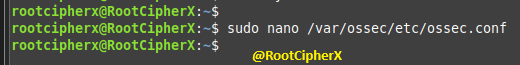

Inspected the `<global>` and `<rootcheck>` XML blocks within the manager's `ossec.conf`. 
*   **`<alerts_log>yes</alerts_log>`:** Ensures alerts are written to `/var/ossec/logs/alerts/alerts.log`.
*   **`<logall>yes</logall>` / `<logall_json>yes</logall_json>`:** Forces the manager to archive all received events regardless of rule matching.
*   **`<rootcheck><disabled>no</disabled><check_files>yes</check_files>`:** Confirms the policy monitoring engine is active for auditing system files and rootkit signatures.
<br>

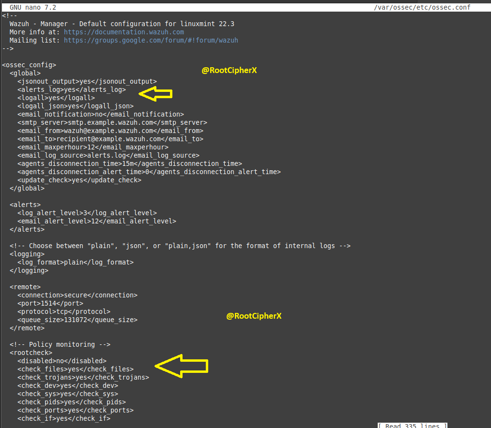

Located the primary `<syscheck>` XML configuration block on the server to verify baseline operational readiness.
*   **`<disabled>no</disabled>`:** Confirms that the global File Integrity Monitoring module is running.
*   **`<frequency>43200</frequency>`:** Sets the fallback scheduled scan interval to 43,200 seconds (12 hours).
<br>

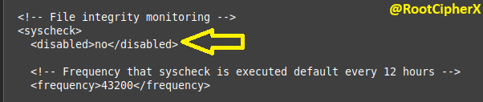

Committed the verified configuration back to disk on the Wazuh Server.
<br>

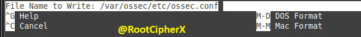

---

### Phase 2: Endpoint FIM & Inotify Real-Time Configuration (Kali Linux)

To monitor files on the Kali Linux endpoint, the local agent's `ossec.conf` must be tailored with specific directory definitions. Opened the agent's configuration file on the Kali terminal.

*   **Command:** `sudo nano /var/ossec/etc/ossec.conf`
*   **Purpose:** Accesses the local agent settings to define which directories to audit, what attributes to monitor, and whether to use real-time kernel notifications.
<br>

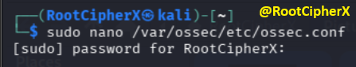

Verified that the agent-side policy monitoring (`<rootcheck>`) module was set to `<disabled>no</disabled>` to ensure baseline integrity scanning was enabled.
<br>

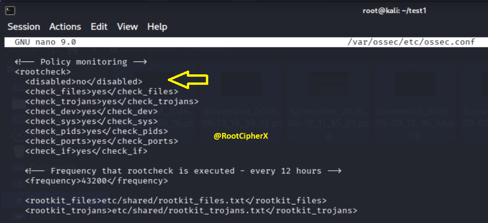

Navigated to the `<syscheck>` block on the Kali agent and configured the critical target directory with granular auditing directives:

```xml
<directories check_all="yes" report_changes="yes" realtime="yes">/root</directories>
```

*   **Directive Breakdown:**
    *   **`/root`:** The absolute path targeted for integrity surveillance.
    *   **`realtime="yes"`:** Hooks directly into the Linux kernel's **inotify** API. This allows Wazuh to detect file operations immediately without waiting for a periodic 12-hour polling cycle.
    *   **`report_changes="yes"`:** Enables differential tracking (`diff`). Copies the file to a secure local database and records the exact text added, changed, or deleted.
    *   **`check_all="yes"`:** Audits all file attributes, including MD5/SHA-1/SHA-256 hashes, file size, permissions, owner, group, and modification timestamps (`mtime`).
<br>

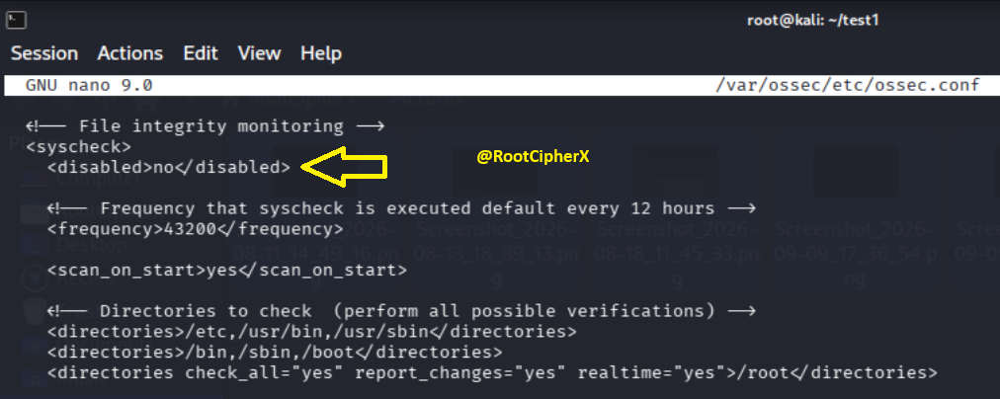

Saved the modified configuration file to `/var/ossec/etc/ossec.conf` on the Kali Linux agent.
<br>

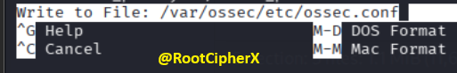

---

### Phase 3: Service Synchronization & Daemon Reloads

Configuration updates to `ossec.conf` do not take effect until the background worker processes are restarted. Executed service reloads across both endpoints to synchronize the new rules.

Restarted the agent daemon on Kali Linux:
*   **Command:** `sudo systemctl restart wazuh-agent`
*   **Purpose:** Stops and restarts `wazuh-agentd` and `syscheckd` on the endpoint, initializing the kernel inotify watch on `/root`.
<br>

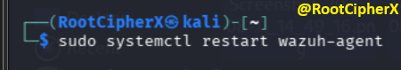

Restarted the manager service on Linux Mint:
*   **Command:** `sudo systemctl restart wazuh-manager`
*   **Purpose:** Re-reads the master configuration and database definitions to ensure the manager is ready to decode incoming real-time FIM alert payloads.
<br>

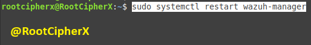

---

### Phase 4: Adversary Emulation & File Tampering

To validate the real-time FIM pipeline, an attack sequence simulating payload staging, file modification, and anti-forensic clean-up was executed within `/root` on the Kali Linux machine.

```bash
sudo su
cd /root
sudo touch test1.txt          # 1. Staging initial file
ls
sudo rm test1.txt             # 2. Deleting file (Anti-forensics simulation)
ls
sudo touch test2.txt          # 3. Creating second target
sudo nano test2.txt           # 4. Modifying file contents with text
ls
sudo nano test2.txt           # 5. Further editing content
sudo mkdir test1              # 6. Creating directory structure
ls
cd test1
sudo touch test3.txt          # 7. Dropping nested file inside subfolder
```

*   **Operational Intent:** This sequence triggers all three primary FIM alert classes: **File Added**, **File Deleted**, and **File Modified** (with cryptographic hash recalculations and content diffs).
<br>

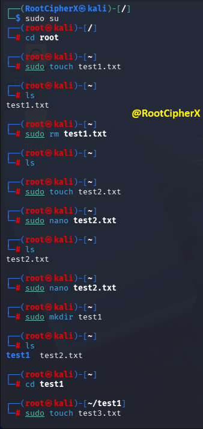

---

### Phase 5: Real-Time Telemetry & Cryptographic Diff Analysis

Switched to the Wazuh Web Dashboard under **File Integrity Monitoring -> Events** filtered by `agent.id: 002`. The initial creation of `test1.txt` triggered sub-second detection:
*   **Rule ID:** `554` (Rule Level 5)
*   **Rule Description:** `File added to the system.`
*   **Path:** `/root/test1.txt`
*   **Event:** `added`
<br>

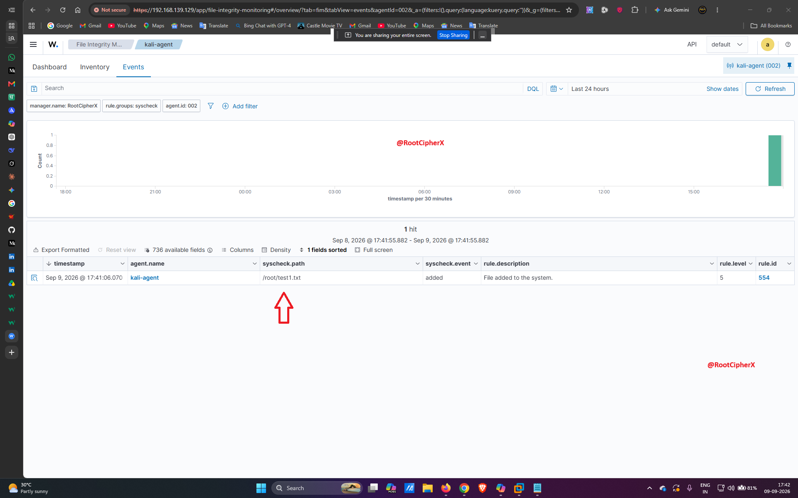

Drilled down into the detailed JSON document for the file addition alert:
*   **`full_log`:** `File '/root/test1.txt' added Mode: realtime`
*   **`decoder.name`:** `syscheck_new_entry`
*   **`syscheck.mode`:** Confirms the event was captured via the real-time inotify engine.
*   **`syscheck.md5_after`:** Automatically generated baseline cryptographic checksum (`d41d8cd98f00b204e9800998ecf8427e` - standard empty file MD5).
<br>

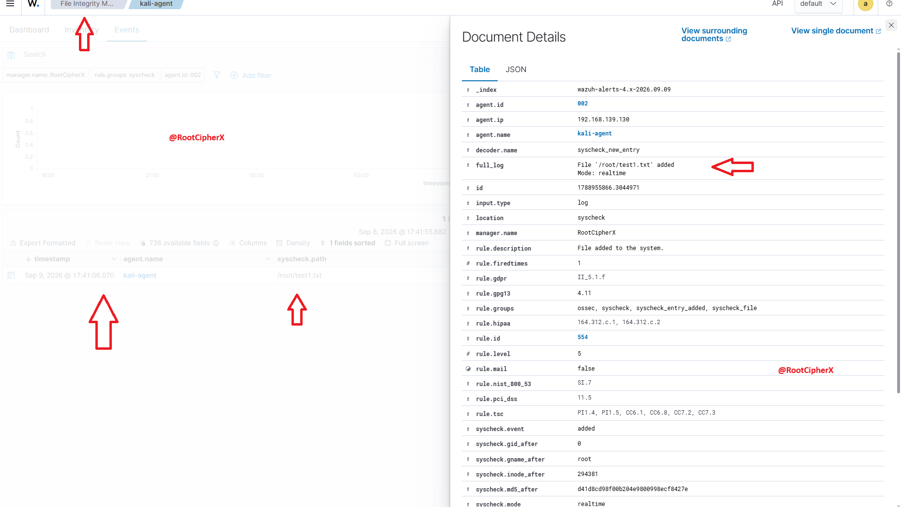

Refreshed the event viewer after completing the emulation sequence. A total of **6 distinct integrity events** were ingested and categorized:
*   **`/root/test1.txt`:** Added (`Rule 554`, Level 5).
*   **`/root/test1.txt`:** Deleted (`Rule 553`, Level 7 - `File deleted.`).
*   **`/root/test2.txt`:** Added (`Rule 554`, Level 5).
*   **`/root/test2.txt`:** Modified (`Rule 550`, Level 7 - `Integrity checksum changed.`).
*   **`/root/test1/test3.txt`:** Added (`Rule 554`, Level 5).
*   **`/root/.zsh_history`:** Modified (`Rule 550`, Level 7).
<br>

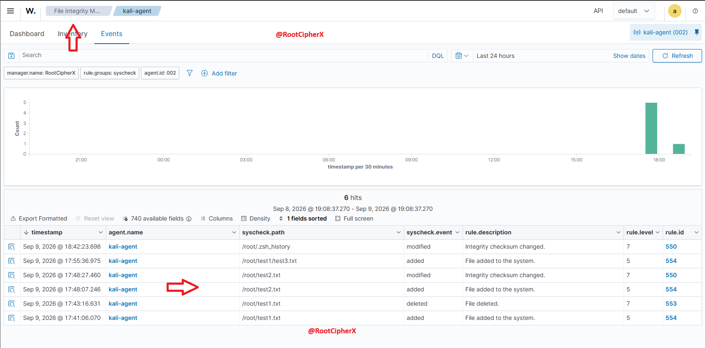

Selected the modification event for `/root/test2.txt` to inspect the forensic details:
*   **Rule ID:** `550` (Severity Level 7)
*   **Changed Attributes:** `size, mtime, md5, sha1, sha256`
*   **File Size Delta:** Increased from `0` bytes to `26` bytes.
*   **MITRE ATT&CK Mapping:** Automatically correlated to **Technique T1565.001** (*Stored Data Manipulation*) under the **Impact** tactic.
<br>

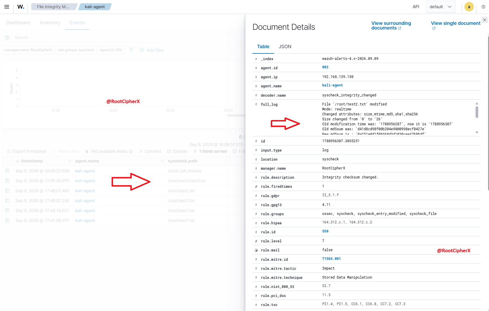

Scrolled through the document details to view the cryptographic verification and content differential:
*   **Cryptographic Hashes:**
    *   `md5_before`: `d41d8cd98f00b204e9800998ecf8427e` ➔ `md5_after`: `0a251e0d1f08468d3d1030cee47b9bdf`
    *   `sha256_before`: `e3b0c44298fc1c149afbf4c8996fb92427ae41e4649b934ca495991b7852b855` ➔ `sha256_after`: `2ccb62a4c466d98ed49fd430afbef8efb0f0c56e1be97c14ac4eec815e0605c3`
*   **`syscheck.diff`:** Captures the exact lines injected into the file:
    ```text
    0a1,2
    > Hello..
    > this is test file
    ```
<br>

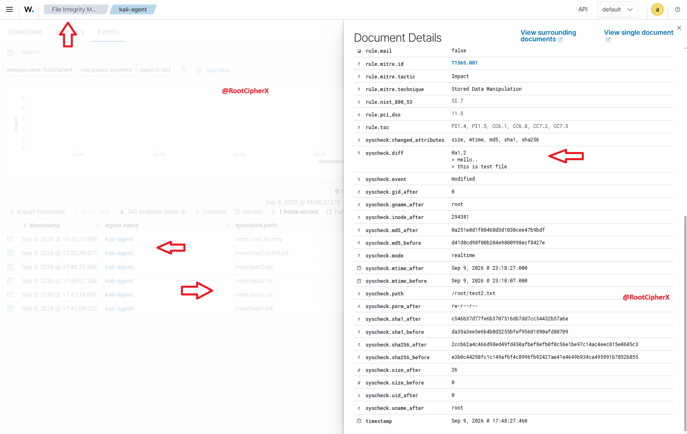

---

### Phase 6: Dashboard Metrics & MITRE ATT&CK Correlation

Navigated to the agent's dedicated overview dashboard, which aggregates data across monitoring modules:
*   **System Inventory:** Confirms endpoint health (2 cores, 3.8 GB RAM, Kali Linux).
*   **Compliance & Benchmarks:** PCI DSS tracking ring chart alongside CIS Benchmark results (47% score across 87 passed checks).
*   **Top Tactics:** Live tracking of Defense Evasion, Privilege Escalation, Initial Access, and Persistence.
<br>

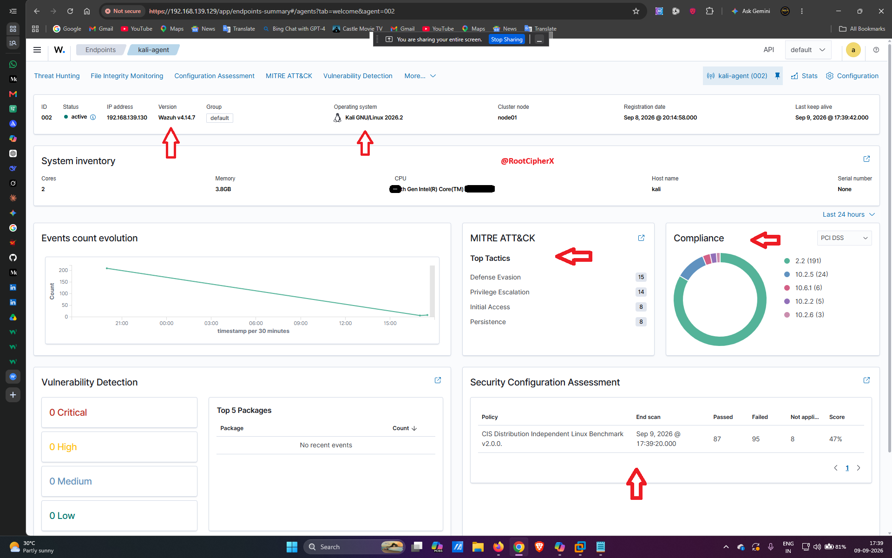

Navigated to the global **MITRE ATT&CK** dashboard to evaluate tactical correlation:
*   The file tampering events were integrated into enterprise heatmaps, tracking techniques such as *Modify Registry*, *Data Destruction*, and *Stored Data Manipulation*.
*   Visualizes adversarial activity by tactic distribution, event frequency, and agent source.
<br>

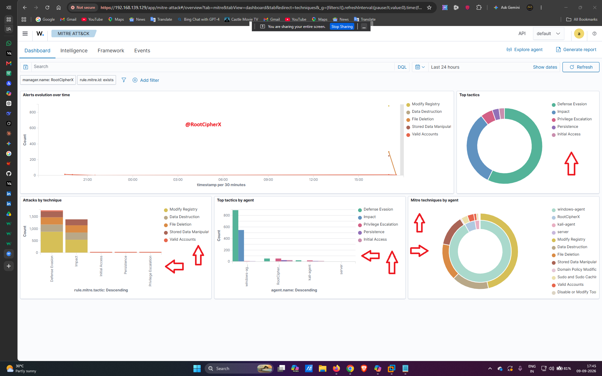

Finally, accessed the dedicated **File Integrity Monitoring Dashboard** for `kali-agent (002)`:
*   **Most Active Users:** `root (100%)` identified as the sole actor responsible for file changes.
*   **Action Distribution:** Visual breakdown confirming `added (50%)`, `modified (25%)`, and `deleted (25%)`.
*   **Categorized Targets:** Distinct donut charts mapping added (`test1.txt`, `test2.txt`), modified (`test2.txt`), and deleted (`test1.txt`) targets.
<br>

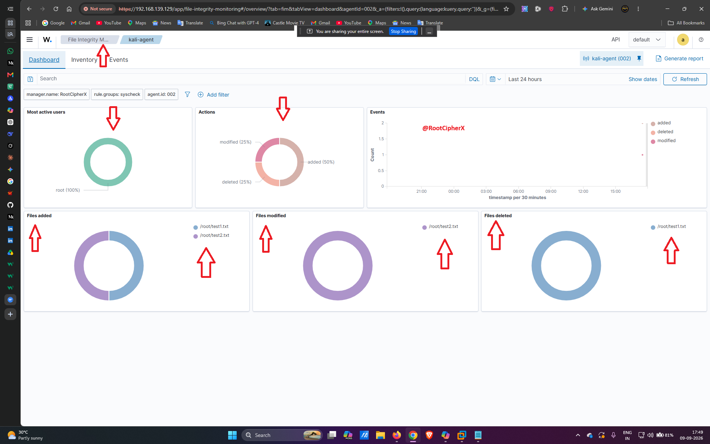

A complementary dashboard query view confirms continuous monitoring of active files, including nested paths (`/root/test1/test3.txt`) and user shell history files (`/root/.zsh_history`).
<br>

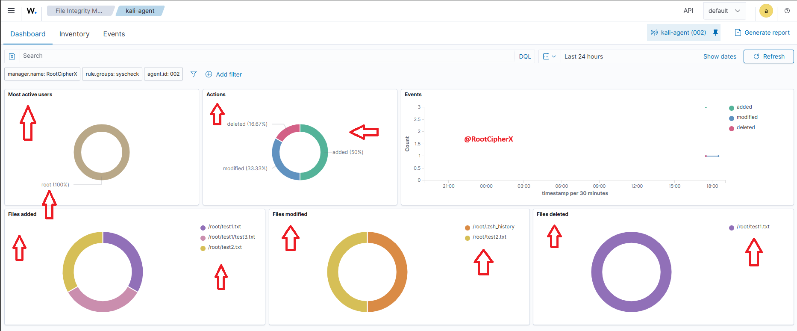

---

## Security Relevance & SOC Impact
File Integrity Monitoring is a core requirement for regulatory frameworks (PCI DSS Requirement 11.5, NIST SP 800-53 SI-7, HIPAA) and a vital line of defense against modern threats:
*   **Sub-Second Detection of Web Shells:** Using `realtime="yes"` (inotify) eliminates the detection lag of scheduled batch scans, alerting analysts the second a malicious PHP or JSP file lands on a server.
*   **Forensic Verification:** Capturing pre- and post-modification cryptographic hashes proves whether file integrity was compromised, providing non-repudiation during incident response investigations.
*   **Diff Inspection:** The `report_changes="yes"` directive captures the exact text added by an adversary, revealing attacker payloads, modified configuration settings, or inserted backdoor accounts directly inside the SIEM alert.

---

## Ethical Guidelines & Disclaimer
This lab was conducted within an isolated, private virtualized lab environment for educational, defensive engineering, and security operations training. All file tampering commands were executed strictly on authorized local lab virtual machines to demonstrate detection capabilities.
